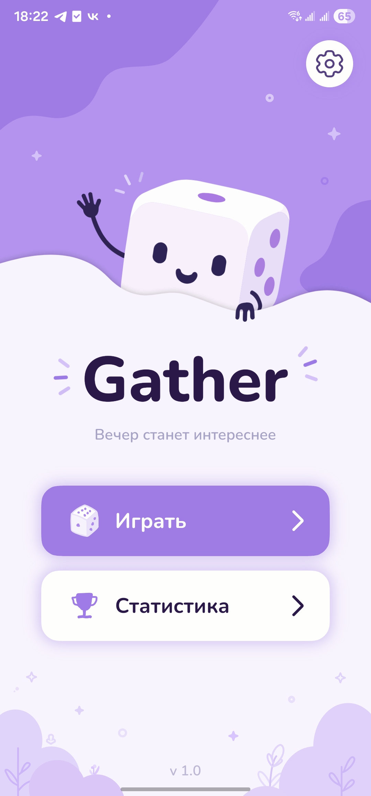
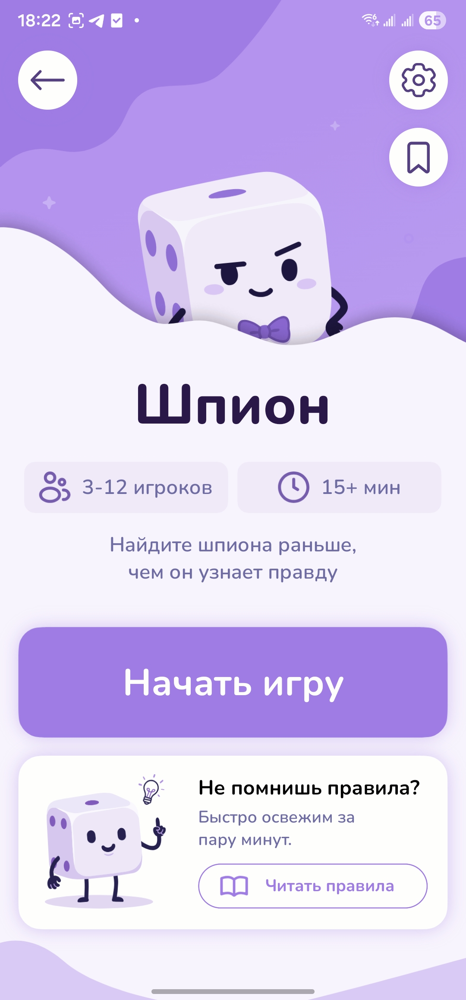
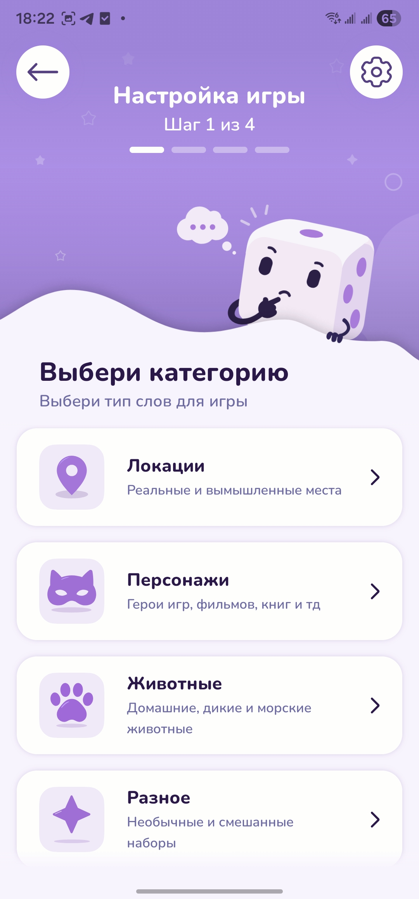
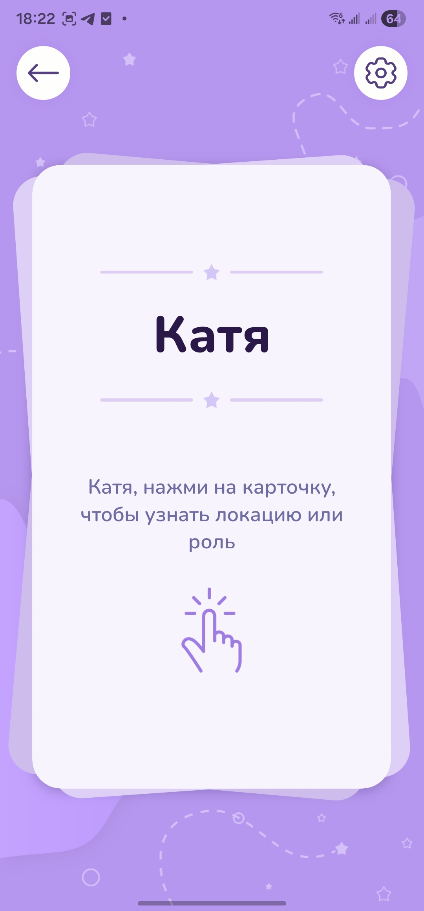
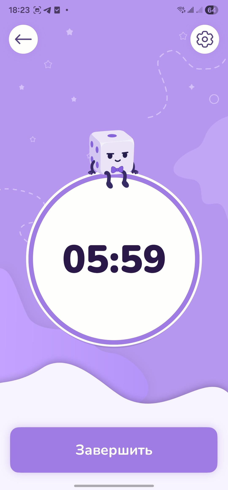
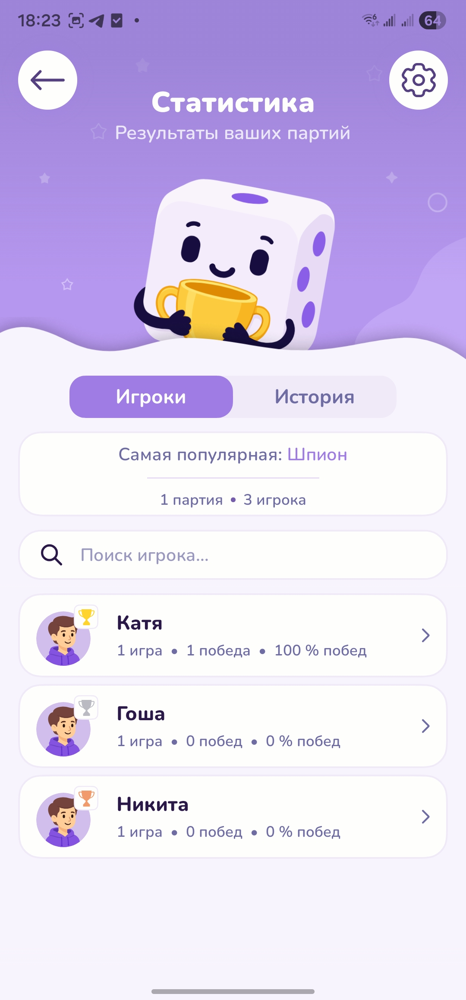
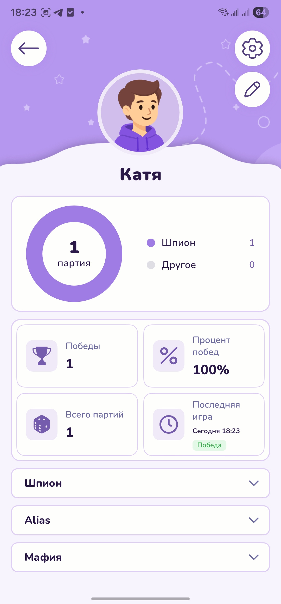
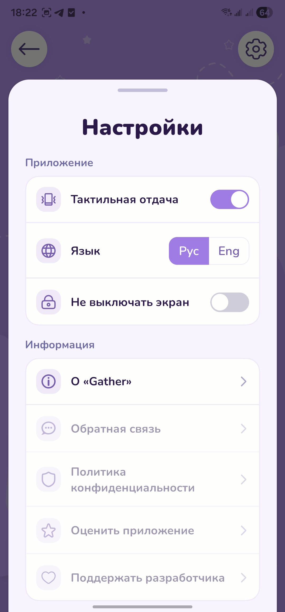

  

  # Gather

  **Офлайн-приложение для совместных игр с акцентом на плавный интерфейс, адаптивность и локальное хранение данных.**

  
  
  
  
  

  [English](README.en.md) · [Скачать APK](https://github.com/Stolzie071/gather-party-app/releases/latest) · [Архитектура](docs/ARCHITECTURE.md) · [Приватность](docs/PRIVACY.md)

## О приложении

Gather превращает один телефон в помощника для настольных игр в компании. В версии 1.0 полностью реализован **«Шпион»**: настройка партии, приватная раздача ролей, таймер, выбор победителей и локальная статистика игроков — без аккаунта, сервера и обязательного интернета.

Проект самостоятельно пройден от дизайна в Figma до адаптивной реализации на React Native, настройки нативной Android-сборки, оптимизации производительности и тестирования на реальных устройствах.

## Что реализовано

- Полный игровой цикл «Шпиона» для 3–12 игроков и одного или нескольких шпионов.
- Встроенные и пользовательские наборы слов; в одной партии можно объединить несколько наборов.
- 62 иллюстрированные локации в наборах «Природа», «Развлечения» и «Города».
- Игра не ограничивается локациями: доступны текстовые наборы с персонажами Dota, супергероями Marvel, животными, профессиями и школьными предметами.
- Сохраняемые игроки с готовыми аватарами или собственными обрезанными фотографиями.
- Настройка таймера, количества шпионов и знания шпионами друг друга.
- Перемешивание раздачи, подсказки сообщникам, защита от случайного выхода, выбор победителей и виброотклик.
- История партий, профили игроков, поиск, фильтры, сортировка и статистика.
- Адаптивные экраны, проверенные на маленьких и больших Android-устройствах.
- Русская и английская локализация интерфейса.
- Alias и «Мафия» представлены в каталоге как будущие игры.

## Скриншоты

<table>
  <tr>
    <td align="center"> Главный экран</td>
    <td align="center"> Игра «Шпион»</td>
    <td align="center"> Настройка партии</td>
    <td align="center"> Раздача ролей</td>
  </tr>
  <tr>
    <td align="center"> Игровой таймер</td>
    <td align="center"> Общая статистика</td>
    <td align="center"> Профиль игрока</td>
    <td align="center"> Настройки</td>
  </tr>
</table>

## Как проходит партия

1. Игрок выбирает категорию и один или несколько встроенных либо собственных наборов.
2. Выбирает сохранённых игроков или создаёт новые профили с аватаром или фотографией.
3. Настраивает количество шпионов, таймер и знание шпионами друг друга.
4. Игроки передают телефон и по очереди приватно узнают роль.
5. Партия проходит с таймером или без него, после чего отмечаются победители.
6. Результат сохраняется в истории и статистике игроков.

## Технические особенности

- **Local-first:** настройки, игроки, пользовательские наборы, активная партия, история и статистика хранятся на устройстве.
- **Расширяемая архитектура:** общие компоненты, навигация, модальные окна, переходы, игроки и хранилище отделены от правил и контента конкретной игры.
- **Оптимизация релиза:** ARM64 APK уменьшен примерно с **190,84 МБ до 33,55 МБ**, universal APK весит **82,12 МБ**.
- **Оптимизация изображений:** 62 картинки локаций уменьшены со **113,44 МБ до 5,32 МБ** без заметной потери качества в приложении.
- **Проверки качества:** проходят **35 автоматических тестов в 7 наборах**, дополнительно приложение проверялось вручную на реальных устройствах и разных размерах экрана.
- **Нативный релиз:** включены R8 и удаление неиспользуемых ресурсов; постоянная подпись позволяет устанавливать будущие версии поверх текущей.

## Стек

| Область | Технологии |
| --- | --- |
| Приложение | React Native 0.81, React 19, Expo SDK 54, TypeScript 5.9 |
| Навигация | React Navigation 7, native stack, кастомные переходы экранов |
| Анимации и жесты | Reanimated 4, Gesture Handler |
| Хранение | AsyncStorage и локальные файлы приложения |
| Возможности устройства | Image Picker, Image Manipulator, Media Library, Haptics, Keep Awake, Localization |
| Графика | SVG и оптимизированные растровые иллюстрации |
| Качество | Jest, jest-expo, ESLint, TypeScript |
| Android-релиз | Gradle, R8, resource shrinking, постоянная подпись |

Подробнее: [обзор архитектуры](docs/ARCHITECTURE.md).

## Установка

Скачайте последнюю сборку в [GitHub Releases](https://github.com/Stolzie071/gather-party-app/releases/latest):

- **ARM64 APK** — рекомендуемый и более компактный вариант для большинства современных телефонов.
- **Universal APK** — запасной вариант для устройств с другой архитектурой процессора.

Минимальная версия — **Android 7.0 (API 24)**. При установке вне Google Play Android может запросить разрешение на установку из браузера или файлового менеджера.

## Приватность

Gather не требует аккаунта и не передаёт данные партий или игроков на сервер. Профили, фотографии, пользовательские наборы, история и настройки остаются на устройстве. Доступ к фото запрашивается только при использовании соответствующей функции. Подробнее — в [описании приватности](docs/PRIVACY.md).

## Состояние проекта

Версия 1.0 — готовый Android-релиз для портфолио, построенный вокруг игры «Шпион». В дальнейшем планируются правила, музыка и звуки, тёмная тема, дополнительный контент, а также полноценные Alias и «Мафия».

## Исходный код

В публичном репозитории намеренно находятся презентация проекта и релизная информация, но отсутствуют проприетарный исходный код и оригинальные дизайн-файлы. Приватную кодовую базу можно продемонстрировать на техническом собеседовании по запросу.

## Автор

Дизайн и разработка — **Tony**: [@Stolzie071](https://github.com/Stolzie071).

Ограничения использования описаны в [NOTICE.md](NOTICE.md).
