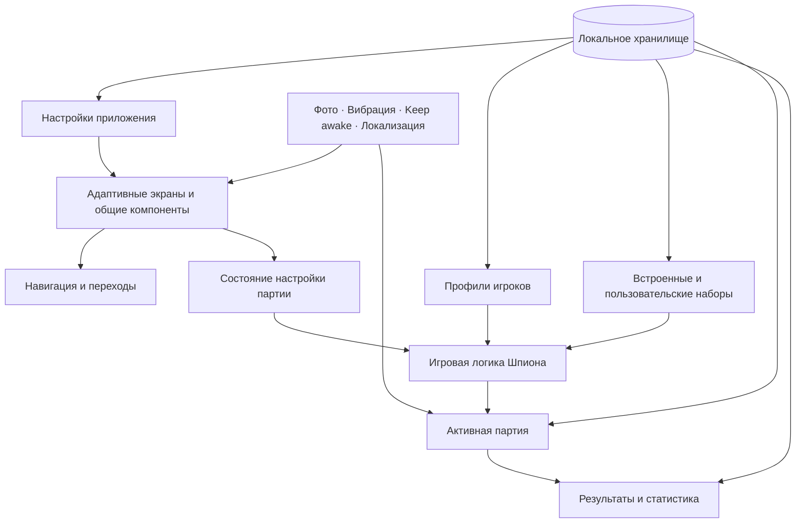

# Архитектура Gather

Документ описывает архитектуру приложения на высоком уровне.

## Основные цели

- Быстрая и понятная настройка партии на одном общем телефоне.
- Возможность добавлять новые игры без привязки общих экранов к правилам «Шпиона».
- Полноценная работа без аккаунта, сервера и обязательного интернета.
- Плавная навигация и анимации на Android-устройствах разной мощности.
- Переиспользование игроков, настроек, статистики и общих компонентов между играми.

## Общая схема

## Слои приложения

### Интерфейс

Адаптивные экраны, карточки, элементы управления, модальные окна, нижние шторки, состояния загрузки, анимации нажатия и переходы. Для компактных и больших экранов предусмотрены отдельные варианты расположения элементов.

### Навигация

Навигация всего приложения отделена от внутреннего сценария конкретной игры. Благодаря этому игра управляет собственными этапами — настройкой, раздачей ролей, партией и результатами — сохраняя единое поведение кнопок назад, настроек и защиты от случайного выхода.

### Игровая логика

Логика «Шпиона» получает проверенные настройки, выбранный контент и идентификаторы игроков. Она перемешивает порядок раздачи, назначает роли, управляет состоянием таймера и формирует итог партии. Интерфейс отображает вычисленное состояние, но не хранит внутри себя правила игры.

### Контент

Встроенные категории и наборы представлены структурированными данными. Пользовательские наборы во время игры приводятся к тому же формату, поэтому несколько совместимых наборов можно объединить перед созданием партии. Один контракт поддерживает как иллюстрированные локации, так и слова без картинок.

### Хранение данных

Настройки, игроки, пользовательские наборы, незавершённая партия, история и статистика сохраняются локально. Фотографии игроков копируются во внутреннее хранилище приложения, поэтому удаление оригинала из галереи не ломает аватар.

### Возможности устройства

Приложение использует системный выбор и кадрирование изображений, сохранение в галерею, виброотклик, локализацию и запрет выключения экрана во время партии. Разрешения запрашиваются непосредственно при использовании соответствующей функции.

## Стабильность и производительность

- Игровая логика и слой хранения покрыты автоматическими тестами.
- Тяжёлые ресурсы подготавливаются вне критичных для анимации моментов.
- Растровые изображения сжаты под реальный размер отображения.
- В релизе включены R8 и удаление неиспользуемых Android-ресурсов.
- Навигация и прокрутка проверялись на реальных телефонах и эмуляторах.
- Критичные действия, например запуск и завершение партии, защищены от двойного нажатия.

## Расширение проекта

Будущие игры смогут переиспользовать каталог игроков, работу с аватарами, настройки, навигационный каркас, каталог игр, статистику, диалоги, переходы и хранилище. Конкретная игра предоставляет собственные настройки, контент, правила и игровые экраны.

## Исходный код

Репозиторий с реализацией остаётся приватным. Здесь намеренно описаны ответственность модулей, поток данных и технические решения без публикации внутренней структуры и исходников.

